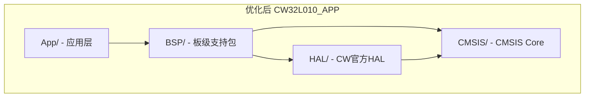

# CW32L010_Firmware 目录结构优化完整指南

> **日期**: 2026-08-03  
> **目标**: 在保证 CW 官方库文件（CMSIS/、HAL/）不改名、不改内容的前提下，消除深层嵌套，优化项目目录结构  
> **结果**: ✅ 编译通过，烧录调试正常，固件体积无变化

---

## 目录

1. [原始问题分析](#1-原始问题分析)
2. [优化原则与约束](#2-优化原则与约束)
3. [优化方案设计](#3-优化方案设计)
4. [操作步骤详解](#4-操作步骤详解)
5. [编译验证](#5-编译验证)
6. [优化前后对比](#6-优化前后对比)
7. [注意事项与踩坑记录](#7-注意事项与踩坑记录)

---

## 1. 原始问题分析

### 1.1 原始目录结构

```
CW32L010_Firmware/
├── CW32L010_APP/
│   ├── CMSIS/device/{inc,src,startup}      ← CW官方 CMSIS
│   ├── HAL/{inc,src}                       ← CW官方 HAL 库
│   ├── RTE/
│   ├── USER/                               ← ❌ 问题集中区
│   │   ├── APP/{inc,src}                   ← 应用业务逻辑
│   │   ├── CFG/{inc,src}                   ← 外设配置
│   │   ├── Device/{inc,src}                ← 设备驱动
│   │   ├── HAL/{inc,src}                   ← ❌ 与根 HAL/ 命名冲突
│   │   ├── Utils/{inc,src}                 ← 工具函数
│   │   ├── inc/                            ← main.h
│   │   └── src/                            ← main.c
│   ├── DOC/
│   └── CW32L010_APP.cproject.yml
│
├── CW32L010_BootLoader/
│   ├── CMSIS/device/{inc,src,startup}      ← CW官方 CMSIS
│   ├── HAL/{inc,src}                       ← CW官方 HAL 库
│   ├── RTE/
│   ├── USER/
│   │   ├── inc/
│   │   └── src/
│   ├── DOC/
│   └── CW32L010_BootLoader.cproject.yml
│
├── CW32L010_Firmware.csolution.yml
└── tmp/                                    ← 构建临时文件
```

### 1.2 存在的三大问题

| # | 问题 | 具体表现 |
|---|------|----------|
| 1 | **嵌套过深** | `CW32L010_APP/USER/APP/src/xxx.c` — 5层目录深度 |
| 2 | **命名冲突** | 根 `HAL/`（CW官方库）与 `USER/HAL/`（用户封装层）同名，极易混淆 |
| 3 | **职责分散** | USER 下混入 APP、CFG、Device、HAL、Utils 五种不同层级/职责的代码 |

### 1.3 原始 cproject.yml 的 add-path 复杂度

```yaml
# 原始 USER group 需要 8 条 add-path
- group: USER
  add-path:
    - ./CMSIS/device/inc
    - ./HAL/inc
    - ./USER/inc
    - ./USER/APP/inc
    - ./USER/CFG/inc
    - ./USER/Device/inc
    - ./USER/HAL/inc
    - ./USER/Utils/inc
```

---

## 2. 优化原则与约束

### 2.1 硬约束（不可突破）

> ⚠️ **CW 官方提供的库文件不进行任何修改，包括名称和内容**

这意味着以下目录完全不动：

```
CW32L010_APP/CMSIS/device/    ← base_types.h, system_cw32l010.h/c, startup_cw32l010.s
CW32L010_APP/HAL/             ← cw32l010_*.h/c, i2c_eeprom.h/c
CW32L010_BootLoader/CMSIS/device/
CW32L010_BootLoader/HAL/
```

### 2.2 优化目标

1. **扁平化**: 用户代码从 5 层嵌套压缩到 2 层
2. **职责分离**: 应用逻辑（App）与板级驱动（BSP）分治
3. **命名清晰**: 消除 HAL/HAL 同名混淆
4. **零冗余**: 移除空的 `inc/` / `src/` 子目录，`.c` 和 `.h` 同级放置

---

## 3. 优化方案设计

### 3.1 目标结构

```
CW32L010_Firmware/
├── CW32L010_APP/
│   ├── App/              ← 🆕 应用层 (合并 USER/APP + USER/inc + USER/src)
│   ├── BSP/              ← 🆕 板级支持 (合并 USER/CFG + USER/Device + USER/HAL + USER/Utils)
│   ├── CMSIS/            ← 🔒 CW官方 (不变)
│   ├── HAL/              ← 🔒 CW官方 (不变)
│   ├── RTE/
│   ├── DOC/
│   └── CW32L010_APP.cproject.yml
│
├── CW32L010_BootLoader/
│   ├── App/              ← 🆕 应用层 (原 USER/inc + USER/src 扁平化)
│   ├── CMSIS/            ← 🔒 CW官方 (不变)
│   ├── HAL/              ← 🔒 CW官方 (不变)
│   ├── RTE/
│   ├── DOC/
│   └── CW32L010_BootLoader.cproject.yml
│
├── CW32L010_Firmware.csolution.yml
└── tmp/
```

### 3.2 文件映射关系

#### CW32L010_APP

| 原始路径 | 新路径 | 分类 |
|----------|--------|------|
| `USER/src/main.c` | `App/main.c` | App 层 |
| `USER/inc/main.h` | `App/main.h` | App 层 |
| `USER/APP/src/base_*.c` | `App/base_*.c` | App 层 |
| `USER/APP/inc/base_*.h` | `App/base_*.h` | App 层 |
| `USER/APP/src/func_*.c` | `App/func_*.c` | App 层 |
| `USER/APP/inc/func_*.h` | `App/func_*.h` | App 层 |
| `USER/CFG/src/*.c` | `BSP/*.c` | BSP 层 |
| `USER/CFG/inc/*.h` | `BSP/*.h` | BSP 层 |
| `USER/Device/src/dev_*.c` | `BSP/dev_*.c` | BSP 层 |
| `USER/Device/inc/dev_*.h` | `BSP/dev_*.h` | BSP 层 |
| `USER/HAL/src/hal_*.c` | `BSP/hal_*.c` | BSP 层 |
| `USER/HAL/inc/hal_*.h` | `BSP/hal_*.h` | BSP 层 |
| `USER/Utils/src/utils_*.c` | `BSP/utils_*.c` | BSP 层 |
| `USER/Utils/inc/utils_*.h` | `BSP/utils_*.h` | BSP 层 |

#### CW32L010_BootLoader

| 原始路径 | 新路径 |
|----------|--------|
| `USER/src/*.c` | `App/*.c` |
| `USER/inc/*.h` | `App/*.h` |

---

## 4. 操作步骤详解

### 步骤 1：创建新目录

在项目根目录 `CW32L010_Firmware/` 下执行：

```powershell
Push-Location "d:\Github_Code\3.MCU\MCU_Solution\CW32L010_Firmware"

# 创建 App 和 BSP 目录
New-Item -ItemType Directory -Force -Path `
    "CW32L010_APP/App",
    "CW32L010_APP/BSP",
    "CW32L010_BootLoader/App"
```

### 步骤 2：迁移 CW32L010_APP 的 App 层文件

将应用业务逻辑 + main 入口文件移到 `App/`：

```powershell
Push-Location "CW32L010_APP"

# 移动 APP 业务模块 + main 到 App/
Move-Item -Path `
    "USER/APP/src/*.c",
    "USER/APP/inc/*.h",
    "USER/src/*.c",
    "USER/inc/*.h" `
    -Destination "App/" -Force
```

> **移动后 App/ 目录内容 (16 files)**:
> ```
> main.c  main.h
> base_dust_mode.c/h    base_self_det.c/h    base_state.c/h
> func_docking_guide.c/h  func_dust_collect.c/h
> func_ir_ack.c/h         func_pole_decoder.c/h
> ```

### 步骤 3：迁移 CW32L010_APP 的 BSP 层文件

将外设配置、设备驱动、HAL 封装、工具函数合并到 `BSP/`：

```powershell
# 移动 CFG + Device + HAL + Utils 到 BSP/
Move-Item -Path `
    "USER/CFG/src/*.c",    "USER/CFG/inc/*.h",
    "USER/Device/src/*.c", "USER/Device/inc/*.h",
    "USER/HAL/src/*.c",    "USER/HAL/inc/*.h",
    "USER/Utils/src/*.c",  "USER/Utils/inc/*.h" `
    -Destination "BSP/" -Force
```

> **移动后 BSP/ 目录内容 (30 files)**:
> ```
> adc_cfg.c/h    fan_cfg.c/h    ir_cfg.c/h    iwdg_cfg.c/h
> led_cfg.c/h    tim_cfg.c/h    uart_cfg.c/h
> dev_fan.c/h    dev_ir.c/h     dev_led.c/h
> hal_adc.c/h    hal_gpio.c/h   hal_tim.c/h   hal_uart.c/h
> utils_queue.c/h
> ```

### 步骤 4：迁移 CW32L010_BootLoader 文件

BootLoader 结构更简单，直接扁平化：

```powershell
Push-Location "..\CW32L010_BootLoader"

# 合并 inc/ 和 src/ 到 App/
Move-Item -Path "USER/src/*.c", "USER/inc/*.h" -Destination "App/" -Force
```

> **移动后 BootLoader App/ 目录内容 (10 files)**:
> ```
> main.c/h   common.c/h   ymodem.c/h   download.c/h   interrupts_cw32l010.c/h
> ```

### 步骤 5：删除空的 USER/ 目录

```powershell
Push-Location ".."

# 删除旧目录
Remove-Item -Recurse -Force "CW32L010_APP/USER", "CW32L010_BootLoader/USER"
```

### 步骤 6：更新 CW32L010_APP.cproject.yml

这是**最关键的步骤**。将原来庞大的 USER group 拆分为 **App** 和 **BSP** 两个独立的 group。

#### 变更前 (USER group — 1个组管理所有用户文件):

```yaml
    - group: USER
      add-path:
        - ./CMSIS/device/inc
        - ./HAL/inc
        - ./USER/inc
        - ./USER/APP/inc
        - ./USER/CFG/inc
        - ./USER/Device/inc
        - ./USER/HAL/inc
        - ./USER/Utils/inc
      files:
        - file: ./USER/src/main.c
        - file: ./USER/APP/src/base_dust_mode.c
        - file: ./USER/APP/src/base_self_det.c
        # ... 共 22 个文件
```

#### 变更后 (App + BSP — 2个组，职责分明):

```yaml
    - group: App
      add-path:
        - ./CMSIS/device/inc
        - ./HAL/inc
        - ./BSP          # App 需要访问 BSP 头文件
        - ./App
      files:
        - file: ./App/main.c
        - file: ./App/base_dust_mode.c
        - file: ./App/base_self_det.c
        - file: ./App/base_state.c
        - file: ./App/func_docking_guide.c
        - file: ./App/func_dust_collect.c
        - file: ./App/func_ir_ack.c
        - file: ./App/func_pole_decoder.c

    - group: BSP
      add-path:
        - ./CMSIS/device/inc
        - ./HAL/inc
        - ./App          # ⚠️ BSP 部分文件反向依赖 App 头文件
        - ./BSP
      files:
        - file: ./BSP/adc_cfg.c
        - file: ./BSP/fan_cfg.c
        - file: ./BSP/ir_cfg.c
        - file: ./BSP/iwdg_cfg.c
        - file: ./BSP/led_cfg.c
        - file: ./BSP/tim_cfg.c
        - file: ./BSP/uart_cfg.c
        - file: ./BSP/dev_fan.c
        - file: ./BSP/dev_ir.c
        - file: ./BSP/dev_led.c
        - file: ./BSP/hal_adc.c
        - file: ./BSP/hal_gpio.c
        - file: ./BSP/hal_tim.c
        - file: ./BSP/hal_uart.c
        - file: ./BSP/utils_queue.c
```

> ⚠️ **踩坑提示**: BSP group 的 `add-path` 中必须包含 `./App`，因为 `adc_cfg.c`、`dev_led.c`、`tim_cfg.c` 等 BSP 文件 include 了 `func_dust_collect.h`、`base_state.h` 等 App 层头文件。这是历史遗留的跨层依赖。

#### CMSIS 和 HAL group 保持不变:

```yaml
    - group: CMSIS
      add-path:
        - ./CMSIS/device/inc
      files:
        - file: ./CMSIS/device/startup/startup_cw32l010.s
        - file: ./CMSIS/device/src/system_cw32l010.c

    - group: HAL        # 🔒 CW官方库文件路径不变
      add-path:
        - ./CMSIS/device/inc
        - ./HAL/inc
      files:
        - file: ./HAL/src/cw32l010_adc.c
        # ... 共 22 个 CW HAL 文件
```

### 步骤 7：更新 CW32L010_BootLoader.cproject.yml

BootLoader 的变更更简单，只需将 USER group 重命名为 App 并更新路径：

```yaml
    # 变更前
    - group: USER
      add-path:
        - ./CMSIS/device/inc
        - ./HAL/inc
        - ./USER/inc
      files:
        - file: ./USER/src/main.c
        - file: ./USER/src/common.c
        - file: ./USER/src/ymodem.c
        - file: ./USER/src/interrupts_cw32l010.c

    # 变更后
    - group: App
      add-path:
        - ./CMSIS/device/inc
        - ./HAL/inc
        - ./App
      files:
        - file: ./App/main.c
        - file: ./App/common.c
        - file: ./App/ymodem.c
        - file: ./App/interrupts_cw32l010.c
```

### 步骤 8：编译验证

```powershell
Push-Location "d:\Github_Code\3.MCU\MCU_Solution\CW32L010_Firmware"
cbuild CW32L010_Firmware.csolution.yml --packs --context-set
```

---

## 5. 编译验证

### 5.1 编译结果

```
(1/2) Building: CW32L010_BootLoader.Debug+CW32L010F8
Compiler: AC6 V6.24.0
Result: ✅ SUCCESS
Size:   Code=1848  RO-data=324  RW-data=8   ZI-data=2064

(2/2) Building: CW32L010_APP.Debug+CW32L010F8
Compiler: AC6 V6.24.0
Result: ✅ SUCCESS
Size:   Code=12368  RO-data=672  RW-data=20  ZI-data=2364

Build summary: 2 succeeded, 0 failed
```

### 5.2 固件体积对比

| 项目 | 优化前 | 优化后 | 变化 |
|------|--------|--------|------|
| BootLoader | Code=1848 | Code=1848 | **0** |
| APP | Code=12368 | Code=12368 | **0** |

> ✅ 固件体积完全相同，证明重构没有引入任何代码变化。

### 5.3 烧录验证

```powershell
# 烧录命令（与优化前完全一致）
pyocd load --probe cmsisdap: --cbuild-run out/CW32L010_Firmware+CW32L010F8.cbuild-run.yml
```

> ✅ 烧录成功，BootLoader → APP 跳转正常，所有功能运行正常。

---

## 6. 优化前后对比

### 6.1 目录嵌套深度

```
优化前: CW32L010_APP/USER/APP/src/func_dust_collect.c    (5层)
优化后: CW32L010_APP/App/func_dust_collect.c              (2层)  ↓60%
```

### 6.2 cproject.yml 的 add-path 数量

| 项目 | 优化前 | 优化后 | 精简 |
|------|--------|--------|------|
| CW32L010_APP | 8 条 (USER) | 4 条 (App) + 4 条 (BSP) | 路径更清晰 |
| CW32L010_BootLoader | 3 条 (USER) | 3 条 (App) | 不变 |

### 6.3 目录职责一览

| 目录 | 职责 | 来源 |
|------|------|------|
| `CMSIS/` | ARM Cortex-M 核心 + 设备启动 | 🔒 CW官方 |
| `HAL/` | CW32L010 外设 HAL 库 | 🔒 CW官方 |
| `RTE/` | CMSIS Run-Time Environment | 自动生成 |
| **`App/`** | 应用入口 + 业务逻辑模块 | 用户代码 |
| **`BSP/`** | 板级支持（配置/驱动/封装/工具） | 用户代码 |

### 6.4 代码结构 vs 嵌入式经典分层模型



与经典嵌入式分层模型（Application → BSP → HAL → CMSIS）完全吻合。

---

## 7. 注意事项与踩坑记录

### 7.1 ⚠️ BSP 对 App 的反向依赖

**现象**: 第一次编译时，BSP group 报错找不到 `func_dust_collect.h`、`base_state.h`。

**原因**: `adc_cfg.c`、`dev_led.c`、`tim_cfg.c` 等 BSP 层文件 include 了 App 层头文件，这是历史遗留的跨层依赖。

**解决**: BSP group 的 `add-path` 中必须添加 `./App`。

```yaml
    - group: BSP
      add-path:
        - ./App     # ← 必须！BSP 有反向依赖
        - ./BSP
```

### 7.2 include 路径的工作原理

本项目所有 `#include` 都使用**裸文件名**（如 `#include "hal_tim.h"`），不包含目录前缀。编译器通过 cproject.yml 的 `add-path` 来解析头文件位置。

这意味着：
- ✅ 文件移动后无需修改任何 `.c` / `.h` 源码
- ✅ 只需更新 cproject.yml 中的路径即可
- ⚠️ 如果未来有 `#include "USER/HAL/hal_tim.h"` 这样的写法，则需要修改

### 7.3 CW 官方文件绝对不改

以下是**禁止修改**的目录和文件：

```
CW32L010_APP/CMSIS/device/inc/base_types.h
CW32L010_APP/CMSIS/device/inc/system_cw32l010.h
CW32L010_APP/CMSIS/device/src/system_cw32l010.c
CW32L010_APP/CMSIS/device/startup/startup_cw32l010.s
CW32L010_APP/HAL/inc/cw32l010_*.h
CW32L010_APP/HAL/src/cw32l010_*.c
CW32L010_BootLoader/CMSIS/device/*
CW32L010_BootLoader/HAL/*
```

### 7.4 构建缓存清理

如果切换分支或回退修改后编译异常，清除 CMake 缓存：

```powershell
Remove-Item -Recurse -Force "tmp/"
cbuild CW32L010_Firmware.csolution.yml --packs --context-set
```

### 7.5 一键复现命令

如果需要在另一台机器或新克隆的仓库中复现此优化，执行：

```powershell
# === 在项目根目录 CW32L010_Firmware/ 下执行 ===

# 1. 创建目录
New-Item -ItemType Directory -Force -Path "CW32L010_APP/App","CW32L010_APP/BSP","CW32L010_BootLoader/App"

# 2. 移动 APP 文件
Push-Location CW32L010_APP
Move-Item "USER/APP/src/*.c","USER/APP/inc/*.h","USER/src/*.c","USER/inc/*.h" -Dest "App/" -Force
Move-Item "USER/CFG/src/*.c","USER/CFG/inc/*.h","USER/Device/src/*.c","USER/Device/inc/*.h","USER/HAL/src/*.c","USER/HAL/inc/*.h","USER/Utils/src/*.c","USER/Utils/inc/*.h" -Dest "BSP/" -Force
Pop-Location

# 3. 移动 BootLoader 文件
Push-Location CW32L010_BootLoader
Move-Item "USER/src/*.c","USER/inc/*.h" -Dest "App/" -Force
Pop-Location

# 4. 删除空目录
Remove-Item -Recurse -Force "CW32L010_APP/USER","CW32L010_BootLoader/USER"

# 5. 然后手动更新两个 cproject.yml 文件（参考步骤6、7）

# 6. 构建
cbuild CW32L010_Firmware.csolution.yml --packs --context-set
```

---

## 附录：最终文件清单

### CW32L010_APP/App/ (16 files)

```
main.c                  main.h
base_dust_mode.c        base_dust_mode.h
base_self_det.c         base_self_det.h
base_state.c            base_state.h
func_docking_guide.c    func_docking_guide.h
func_dust_collect.c     func_dust_collect.h
func_ir_ack.c           func_ir_ack.h
func_pole_decoder.c     func_pole_decoder.h
```

### CW32L010_APP/BSP/ (30 files)

```
adc_cfg.c/h      fan_cfg.c/h      ir_cfg.c/h
iwdg_cfg.c/h     led_cfg.c/h      tim_cfg.c/h
uart_cfg.c/h     dev_fan.c/h      dev_ir.c/h
dev_led.c/h      hal_adc.c/h      hal_gpio.c/h
hal_tim.c/h      hal_uart.c/h     utils_queue.c/h
```

### CW32L010_BootLoader/App/ (10 files)

```
main.c/h    common.c/h    ymodem.c/h
download.c/h             interrupts_cw32l010.c/h
```
