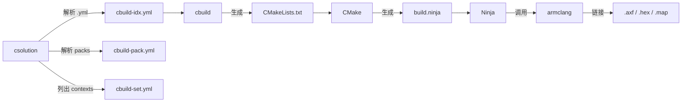
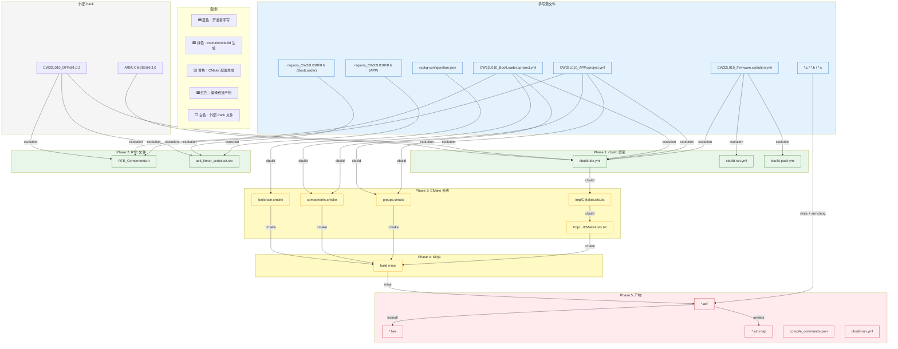
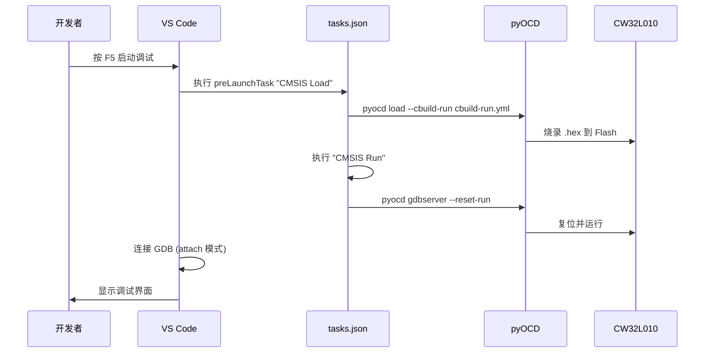

# CW32L010_Firmware 编译系统完整讲解

> **生成日期**: 2026-08-04  
> **项目**: CW32L010_Firmware (基于 CMSIS-Toolbox 2.x 的 ARM Cortex-M0+ 嵌入式固件)

---

## 目录

1. [概述：CMSIS-Toolbox 构建体系](#1-概述cmsis-toolbox-构建体系)
2. [原始文件——指导编译的手写文件](#2-原始文件指导编译的手写文件)
3. [生成文件——工具链自动产出的文件](#3-生成文件工具链自动产出的文件)
4. [编译全流程原理](#4-编译全流程原理)
5. [文件依赖关系图](#5-文件依赖关系图)
6. [关键设计细节](#6-关键设计细节)

---

## 1. 概述：CMSIS-Toolbox 构建体系

本项目采用 **ARM CMSIS-Toolbox** 构建体系，核心工具链包括：



- **csolution** — 解决方案管理器，解析 `.csolution.yml` 和 `.cproject.yml`，生成索引文件
- **cbuild** — 构建生成器，将索引转换为 CMake 构建系统
- **CMake + Ninja** — 跨平台构建系统
- **armclang (AC6)** — ARM Compiler 6，编译器和链接器
- **pyOCD** — 调试和烧录工具

---

## 2. 原始文件——指导编译的手写文件

这些文件由开发者**手动编写和维护**，是整个编译过程的**唯一入口**和**唯一真相来源**。

### 2.1 解决方案级配置文件

| 文件 | 路径 | 作用 |
|------|------|------|
| `CW32L010_Firmware.csolution.yml` | 项目根 | **顶层入口**，定义解决方案的所有上下文 |
| `vcpkg-configuration.json` | 项目根 | 声明工具链依赖（编译器、CMake、Ninja 版本） |
| `gdb.ini` | 项目根 | GDB 调试器字符集配置 |

#### 详解：`.csolution.yml` 的关键配置

```yaml
solution:
  # 目标芯片
  target-types:
    - type: CW32L010F8
      device: CW32L010F8

  # 构建配置（Debug / Release）
  build-types:
    - type: Debug       # 调试版本
    - type: Release     # 发布版本

  # 关联的子项目
  projects:
    - project: CW32L010_BootLoader/CW32L010_BootLoader.cproject.yml
    - project: CW32L010_APP/CW32L010_APP.cproject.yml

  # 依赖的 Pack
  packs:
    - pack: WHXY::CW32L010_DFP    # 芯片设备族包
    - pack: ARM::CMSIS             # CMSIS 标准包

  # 编译器选择
  compiler: AC6
```

**一个 context（构建上下文）= `{项目}.{构建类型}+{目标类型}`**  
例如：`CW32L010_APP.Debug+CW32L010F8`

### 2.2 项目级配置文件

| 文件 | 路径 | 作用 |
|------|------|------|
| `CW32L010_APP.cproject.yml` | `CW32L010_APP/` | APP 项目的源文件组织、组件依赖 |
| `CW32L010_BootLoader.cproject.yml` | `CW32L010_BootLoader/` | BootLoader 项目的源文件组织、组件依赖 |

#### 详解：`.cproject.yml` 的关键配置

```yaml
project:
  # 分组管理源文件
  groups:
    - group: CMSIS          # 启动文件 + 系统初始化
      files:
        - file: ./CMSIS/device/startup/startup_cw32l010.s
        - file: ./CMSIS/device/src/system_cw32l010.c

    - group: HAL            # 硬件抽象层（外设驱动）
      files:
        - file: ./HAL/src/cw32l010_gpio.c
        # ... 等

    - group: App            # 应用层代码
      files:
        - file: ./App/main.c
        # ... 等

    - group: BSP            # 板级支持包
      files:
        - file: ./BSP/hal_gpio.c
        # ... 等

  # 依赖的 CMSIS 软件组件
  components:
    - component: ARM::CMSIS:CORE

  # 输出格式
  output:
    type:
      - elf    # .axf 可执行文件
      - hex    # .hex 固件烧录文件
      - map    # 内存映射文件
```

### 2.3 工具链依赖声明

```json
// vcpkg-configuration.json
{
  "requires": {
    "arm:tools/open-cmsis-pack/cmsis-toolbox": "2.14.1",   // csolution + cbuild
    "arm:tools/kitware/cmake": "3.31.12",                    // CMake
    "arm:tools/ninja-build/ninja": "1.13.2",                 // Ninja
    "arm:compilers/arm/armclang": "6.24.0"                   // ARM 编译器
  }
}
```

### 2.4 VS Code 集成配置文件

| 文件 | 路径 | 作用 |
|------|------|------|
| `.vscode/tasks.json` | `.vscode/` | 定义擦除/烧录/运行/调试任务 |
| `.vscode/launch.json` | `.vscode/` | 定义 GDB 调试启动配置 |
| `.vscode/settings.json` | `.vscode/` | clangd 语言服务器、内存检查器设置 |

### 2.5 源代码文件（开发者手写）

```
CW32L010_APP/
├── App/           # 应用层：业务逻辑、状态机、中断处理
├── BSP/           # 板级支持：设备驱动封装、硬件抽象
├── CMSIS/device/  # 芯片启动代码和系统配置
├── HAL/inc/       # 硬件抽象层头文件（来自 DFP 的库）
└── HAL/src/       # 硬件抽象层源文件（来自 DFP 的库）

CW32L010_BootLoader/
├── App/           # BootLoader 应用层：Ymodem 协议、下载逻辑
├── CMSIS/device/  # 芯片启动代码
├── HAL/inc/       # HAL 头文件（精简版，仅用到的外设）
└── HAL/src/       # HAL 源文件（精简版）
```

### 2.6 需手动维护的 RTE 配置

| 文件 | 路径 | 说明 |
|------|------|------|
| `regions_CW32L010F8.h` | `RTE/Device/CW32L010F8/` | **内存布局配置**（需根据 BootLoader/APP 分区手动修改） |
| `startup_CW32l010.s` | `RTE/Device/CW32L010F8/` | 启动汇编（栈/堆大小可手动调整） |

> **注意**：`regions_CW32L010F8.h` 中 APP 和 BootLoader 的 `__ROM0_BASE` 不同：
> - BootLoader: `0x00000000`（Flash 起始，4KB）
> - APP: `0x00001000`（跳过 BootLoader，60KB）

---

## 3. 生成文件——工具链自动产出的文件

这些文件**不应手动修改**，由 CMSIS-Toolbox 工具链自动生成。任何手动修改都会在下一次构建时被覆盖。

### 3.1 Phase 1：csolution 索引文件（项目根目录）

由 `csolution convert` 命令生成：

| 文件 | 生成时机 | 内容 |
|------|----------|------|
| `CW32L010_Firmware.cbuild-set.yml` | 首次 csolution 运行 | 列出所有构建上下文 |
| `CW32L010_Firmware.cbuild-idx.yml` | 首次 csolution 运行 | 编译索引：项目列表、cbuild 文件路径、构建消息 |
| `CW32L010_Firmware.cbuild-pack.yml` | 首次 csolution 运行 | 解析后的 Pack 依赖（版本锁定） |

**示例** (`cbuild-set.yml`)：
```yaml
cbuild-set:
  generated-by: csolution version 2.14.1
  contexts:
    - context: CW32L010_BootLoader.Debug+CW32L010F8
    - context: CW32L010_APP.Debug+CW32L010F8
```

### 3.2 Phase 2：RTE 自动配置文件（项目 RTE 目录）

由 `csolution` 在解析 Pack 后生成：

| 文件 | 路径 | 说明 |
|------|------|------|
| `RTE_Components.h` | `RTE/_Debug_CW32L010F8/` | **组件选择宏**，定义 `CMSIS_device_header` |
| `ac6_linker_script.sct.src` | `RTE/Device/CW32L010F8/` | **链接脚本模板**（ARM 标准 scatter 文件） |

**RTE_Components.h 内容**：
```c
// CSOLUTION generated file: DO NOT EDIT!
#define CMSIS_device_header "cw32l010.h"
```

**链接脚本** (`ac6_linker_script.sct.src`) 使用了 `regions_CW32L010F8.h` 中定义的宏，实现 BootLoader/APP 的不同内存分区：
```c
LR_ROM0 __ROM0_BASE __ROM0_SIZE {
  ER_ROM0 __ROM0_BASE __ROM0_SIZE {
    *.o (RESET, +First)
    *(InRoot$$Sections)
    *(+RO +XO)
  }
  RW_NOINIT __RAM0_BASE UNINIT (...) { ... }
  // ...
}
```

### 3.3 Phase 3：CMake 构建系统（tmp 目录）

由 `cbuild` 命令生成，将 `.cproject.yml` 转换为 CMake 构建规则：

```
tmp/
├── CMakeLists.txt                    # 顶层 CMake：编排多项目并行构建
├── roots.cmake                       # 路径变量定义
├── CW32L010_APP.Debug+CW32L010F8/
│   ├── CMakeLists.txt                # APP 项目的编译/链接规则
│   ├── groups.cmake                  # 文件分组 → CMake OBJECT 库
│   ├── components.cmake              # CMSIS 组件 → CMake INTERFACE 库
│   └── toolchain.cmake               # 编译器路径和工具链配置
└── CW32L010_BootLoader.Debug+CW32L010F8/
    ├── CMakeLists.txt                # BootLoader 项目的编译/链接规则
    ├── groups.cmake
    ├── components.cmake
    └── toolchain.cmake
```

#### 关键生成逻辑

**tmp/CMakeLists.txt** — 顶层编排文件：
```cmake
# 使用 ExternalProject 管理两个子项目
ExternalProject_Add(CW32L010_BootLoader.Debug+CW32L010F8
  CONFIGURE_COMMAND  ${CMAKE_COMMAND} -G Ninja -S <SOURCE_DIR> -B <BINARY_DIR>
  BUILD_COMMAND      ${CMAKE_COMMAND} --build <BINARY_DIR>
)

ExternalProject_Add(CW32L010_APP.Debug+CW32L010F8
  # ... 同上
)
```

**groups.cmake** — 源文件 → CMake OBJECT 库：
```cmake
# 将 cproject.yml 中的 group "App" 转为 CMake OBJECT 库
add_library(Group_App OBJECT
  "${SOLUTION_ROOT}/CW32L010_APP/App/main.c"
  "${SOLUTION_ROOT}/CW32L010_APP/App/base_dust_mode.c"
  # ... 等
)
target_include_directories(Group_App PUBLIC ...)
```

**components.cmake** — CMSIS 组件 → CMake INTERFACE 库：
```cmake
# 将 component "ARM::CMSIS:CORE" 转为 INTERFACE 库（仅头文件）
add_library(ARM_CMSIS_CORE_6_2_0 INTERFACE)
target_include_directories(ARM_CMSIS_CORE_6_2_0 INTERFACE
  "${CMSIS_PACK_ROOT}/ARM/CMSIS/6.3.0/CMSIS/Core/Include"
)
```

### 3.4 Phase 4：编译中间产物（tmp/{1,2} 目录）

由 CMake 配置阶段生成：

```
tmp/1/   # BootLoader 的 CMake 二进制目录
├── build.ninja               # Ninja 构建规则
├── CMakeCache.txt            # CMake 缓存
├── compile_commands.json     # 编译命令数据库
└── CMakeFiles/               # CMake 内部文件

tmp/2/   # APP 的 CMake 二进制目录
├── build.ninja
├── CMakeCache.txt
├── compile_commands.json
└── CMakeFiles/
```

### 3.5 Phase 5：最终构建产物（out 目录）

由 Ninja 调用 armclang 编译链接后生成：

```
out/
├── CW32L010_Firmware+CW32L010F8.cbuild-run.yml   # 调试/烧录运行配置
├── CW32L010_BootLoader/CW32L010F8/Debug/
│   ├── CW32L010_BootLoader.axf          # ELF 可执行文件（含调试信息）
│   ├── CW32L010_BootLoader.hex          # Intel HEX 烧录文件
│   ├── CW32L010_BootLoader.axf.map      # 内存映射文件
│   ├── compile_commands.json            # 编译命令数据库（供 clangd 使用）
│   └── compile_macros_c.h               # 预处理器宏展开文件
└── CW32L010_APP/CW32L010F8/Debug/
    ├── CW32L010_APP.axf
    ├── CW32L010_APP.hex
    ├── CW32L010_APP.axf.map
    ├── compile_commands.json
    └── compile_macros_c.h
```

### 3.6 根目录汇总文件

| 文件 | 说明 |
|------|------|
| `compile_commands.json` | 全局编译命令数据库（clangd 语言服务器用） |

---

## 4. 编译全流程原理

### 4.1 完整流程图

```mermaid
flowchart TD
    subgraph S1["① 开发者手写文件（真相来源）"]
        A1["CW32L010_Firmware.csolution.yml"]
        A2["CW32L010_APP.cproject.yml"]
        A3["CW32L010_BootLoader.cproject.yml"]
        A4["vcpkg-configuration.json"]
        A5["regions_CW32L010F8.h"]
        A6["startup_cw32l010.s"]
        A7["*.c / *.h 源代码"]
    end

    subgraph S2["② csolution 工具（解析 & 索引）"]
        B1["csolution convert"]
        B2["解析 .csolution.yml"]
        B3["解析 .cproject.yml × 2"]
        B4["解析 Pack: CW32L010_DFP + CMSIS"]
    end

    subgraph S3["③ Phase 1 生成：索引文件"]
        C1["CW32L010_Firmware.cbuild-set.yml"]
        C2["CW32L010_Firmware.cbuild-idx.yml"]
        C3["CW32L010_Firmware.cbuild-pack.yml"]
    end

    subgraph S4["④ Phase 2 生成：RTE 文件"]
        D1["RTE_Components.h"]
        D2["ac6_linker_script.sct.src"]
    end

    subgraph S5["⑤ cbuild 工具（生成 CMake）"]
        E1["cbuild"]
        E2["读取 cbuild-idx.yml"]
        E3["为每个 context 生成 CMakeLists"]
    end

    subgraph S6["⑥ Phase 3 生成：CMake 构建系统"]
        F1["tmp/CMakeLists.txt（顶层）"]
        F2["tmp/.../CMakeLists.txt（项目级）"]
        F3["tmp/.../groups.cmake"]
        F4["tmp/.../components.cmake"]
        F5["tmp/.../toolchain.cmake"]
        F6["tmp/roots.cmake"]
    end

    subgraph S7["⑦ CMake 配置（生成 Ninja）"]
        G1["cmake -G Ninja"]
        G2["tmp/1/build.ninja（BootLoader）"]
        G3["tmp/2/build.ninja（APP）"]
    end

    subgraph S8["⑧ Ninja + armclang（编译 & 链接）"]
        H1["armclang -c → .o 文件"]
        H2["armlink → .axf"]
        H3["fromelf → .hex"]
    end

    subgraph S9["⑨ 最终产物"]
        I1["CW32L010_BootLoader.axf / .hex"]
        I2["CW32L010_APP.axf / .hex"]
        I3["compile_commands.json"]
        I4["cbuild-run.yml"]
    end

    S1 --> S2
    S2 --> S3
    S2 --> S4
    S3 --> S5
    S5 --> S6
    S6 --> S7
    S7 --> S8
    S8 --> S9
```



### 4.2 分步详解

#### 步骤 1：环境准备（vcpkg 激活）

VS Code 启动时，CMSIS 扩展读取 `vcpkg-configuration.json`，通过 vcpkg 下载并激活指定版本的工具链：

```
~/.vcpkg/artifacts/
├── 2139c4c6/compilers.arm.armclang/6.24.0/   # armclang 编译器
├── .../kitware/cmake/3.31.12/                 # CMake
├── .../ninja-build/ninja/1.13.2/              # Ninja
└── .../open-cmsis-pack/cmsis-toolbox/2.14.1/  # csolution + cbuild
```

#### 步骤 2：csolution convert（解析配置）

`csolution` 读取 `.csolution.yml`，进行以下工作：

1. **展开 contexts**：`{BootLoader, APP} × {Debug, Release} × {CW32L010F8}` → 4 个上下文
2. **解析 Packs**：从 `CMSIS_PACK_ROOT`（`~/AppData/Local/Arm/Packs`）查找：
   - `WHXY::CW32L010_DFP@1.0.2` → 芯片启动代码、链接脚本模板、SVD 文件
   - `ARM::CMSIS@6.3.0` → CMSIS-Core 头文件
3. **展开项目**：读取每个 `.cproject.yml`，解析 groups、files、components
4. **生成索引**：输出 `cbuild-set.yml`、`cbuild-idx.yml`、`cbuild-pack.yml`

#### 步骤 3：生成 RTE 文件

`csolution` 同时生成 RTE（Run-Time Environment）配置文件：

- **`RTE_Components.h`**：根据 `.cproject.yml` 中 `components` 声明，生成 `#define CMSIS_device_header "cw32l010.h"`
- **`ac6_linker_script.sct.src`**：从 CMSIS-Toolbox 模板复制，引用 `regions_CW32L010F8.h` 中的地址宏

#### 步骤 4：cbuild（生成 CMake 构建系统）

`cbuild` 读取 `cbuild-idx.yml`，为每个 context 生成 CMake 文件：

| cproject.yml 中的概念 | 转换为 CMake 概念 |
|------------------------|-------------------|
| `project` | `add_executable()` |
| `group` | `add_library(... OBJECT)` |
| `component` | `add_library(... INTERFACE)` |
| `add-path` | `target_include_directories()` |
| `output.type` | `set_target_properties()` |
| `target-types.device` | `-mcpu=cortex-m0plus` 等编译选项 |

**顶层 CMakeLists.txt** 使用 `ExternalProject_Add` 管理两个子项目，支持独立构建。

#### 步骤 5：CMake 配置

CMake 处理生成的 `CMakeLists.txt`：

1. 加载 `toolchain.cmake` → 设置 `armclang` 为编译器
2. 包含 `groups.cmake` → 创建 OBJECT 库（每个源文件组）
3. 包含 `components.cmake` → 创建 INTERFACE 库（CMSIS 组件）
4. 生成 `build.ninja` → Ninja 构建规则文件

#### 步骤 6：Ninja 编译

Ninja 读取 `build.ninja`，并行调用 `armclang`：

```bash
# 编译 C 文件
armclang.exe -mcpu=cortex-m0plus -mlittle-endian \
  -D_RTE_ -D__ARM_FEATURE_LDREX=0 \
  -I RTE/_Debug_CW32L010F8 \
  -I ${CMSIS_PACK_ROOT}/ARM/CMSIS/6.3.0/CMSIS/Core/Include \
  -I ${CMSIS_PACK_ROOT}/WHXY/CW32L010_DFP/1.0.2/Device/Include \
  -c source.c -o source.o

# 汇编启动文件
armclang.exe -mcpu=cortex-m0plus \
  -Wa,armasm,--pd,"_RTE_ SETA 1" \
  -c startup_cw32l010.s -o startup_cw32l010.o
```

#### 步骤 7：链接

`armlink` 使用预处理的 scatter 文件链接所有 `.o` 文件：

```
armlink --scatter ac6_linker_script.sct  *.o  -o CW32L010_APP.axf
```

Scatter 文件中的 `__ROM0_BASE` 和 `__ROM0_SIZE` 由 `regions_CW32L010F8.h` 定义：
- **BootLoader**：`__ROM0_BASE=0x00000000, __ROM0_SIZE=0x00001000`（4KB）
- **APP**：`__ROM0_BASE=0x00001000, __ROM0_SIZE=0x0000F000`（60KB）

#### 步骤 8：生成烧录文件

`fromelf` 将 ELF 转换为 Intel HEX：

```bash
fromelf --i32combined CW32L010_APP.axf -o CW32L010_APP.hex
```

---

## 5. 文件依赖关系图



---

## 6. 关键设计细节

### 6.1 双项目分区机制

本项目包含 **BootLoader** 和 **APP** 两个独立固件，通过内存分区共存于同一 Flash：

```
Flash 布局 (64KB):
┌─────────────────────────┐ 0x00000000
│  BootLoader (4KB)       │ __ROM0_BASE=0x00000000
│  __ROM0_SIZE=0x00001000 │
├─────────────────────────┤ 0x00001000
│  APP (60KB)             │ __ROM0_BASE=0x00001000
│  __ROM0_SIZE=0x0000F000 │
└─────────────────────────┘ 0x00010000
```

- BootLoader 的 `regions_CW32L010F8.h` 中 `__ROM0_BASE=0x00000000`
- APP 的 `regions_CW32L010F8.h` 中 `__ROM0_BASE=0x00001000`
- 两个项目使用**同一份 `ac6_linker_script.sct.src`**（模板），但**不同的 `regions_CW32L010F8.h`** 来区分内存布局

### 6.2 ExternalProject 并行构建

顶层 `tmp/CMakeLists.txt` 使用 CMake 的 `ExternalProject_Add` 机制：

```cmake
ExternalProject_Add(CW32L010_BootLoader.Debug+CW32L010F8
  SOURCE_DIR  tmp/CW32L010_BootLoader.Debug+CW32L010F8
  BINARY_DIR  1    # BootLoader → tmp/1/
)

ExternalProject_Add(CW32L010_APP.Debug+CW32L010F8
  SOURCE_DIR  tmp/CW32L010_APP.Debug+CW32L010F8
  BINARY_DIR  2    # APP → tmp/2/
)
```

这允许两个项目**独立配置和构建**，互不干扰。

### 6.3 OBJECT 库设计

源文件分组使用 CMake **OBJECT 库**而非 STATIC 库：

```cmake
add_library(Group_CMSIS OBJECT
  startup_cw32l010.s
  system_cw32l010.c
)
```

OBJECT 库的优势：编译为 `.o` 文件但不打包为 `.a`，链接时可以直接进行**跨文件优化**和**未使用段消除**。

### 6.4 compile_commands.json 生成

项目生成了两级 `compile_commands.json`：

1. **tmp/{1,2}/compile_commands.json** — CMake 自动生成（Ninja 原生支持）
2. **out/.../compile_commands.json** — 由 CMake 自定义命令复制到输出目录
3. **根目录 compile_commands.json** — 汇总所有 context 的编译命令，供 `clangd` 语言服务器使用

`.vscode/settings.json` 中配置：
```json
"clangd.arguments": [
    "--compile-commands-dir=d:\\Github_Code\\3.MCU\\MCU_Solution\\CW32L010_Firmware"
]
```

### 6.5 调试流程



`cbuild-run.yml` 文件告诉 pyOCD：
- 哪些 `.axf` 文件加载符号（symbols），哪些加载镜像（image）
- 目标芯片的 SVD 文件路径（用于外设寄存器查看）
- 调试器协议（SWD）、时钟频率等

### 6.6 增量构建支持

CMSIS-Toolbox 通过以下机制支持增量构建：

1. **cbuild-idx.yml** 记录文件哈希，检测源文件变更
2. **CMake + Ninja** 原生支持依赖追踪和增量编译
3. **cbuild-pack.yml** 锁定 Pack 版本，避免意外升级

---

## 总结

| 类别 | 文件数（约） | 维护方式 | 说明 |
|------|:----------:|----------|------|
| 🟦 手写配置文件 | ~8 | 开发者手动编写 | `.csolution.yml`, `.cproject.yml`, `vcpkg-configuration.json` 等 |
| 🟦 手写源代码 | ~50+ | 开发者手动编写 | `*.c`, `*.h`, `*.s` |
| 🟦 手写 RTE 配置 | ~4 | 首次生成后手动修改 | `regions_CW32L010F8.h`, `startup_cw32l010.s` |
| 🟩 cbuild 索引文件 | 3 | csolution 自动生成 | `cbuild-set.yml`, `cbuild-idx.yml`, `cbuild-pack.yml` |
| 🟩 RTE 自动文件 | 4 | csolution 自动生成 | `RTE_Components.h`, `ac6_linker_script.sct.src` |
| 🟨 CMake 生成文件 | ~14 | cbuild 自动生成 | `CMakeLists.txt`, `groups.cmake`, `components.cmake` 等 |
| 🟨 build.ninja | 2 | CMake 自动生成 | 位于 `tmp/1/` 和 `tmp/2/` |
| 🟥 最终产物 | ~12 | Ninja + armclang 生成 | `.axf`, `.hex`, `.map`, `compile_commands.json` |

**核心原则**：开发者只需维护以 `.yml` 结尾的配置文件和源代码。所有 `tmp/`、`out/` 目录下的文件，以及根目录的 `cbuild-*.yml` 文件，都是工具链自动生成的。`RTE/` 目录下的文件是混合的——部分由 `csolution` 从 Pack 生成模板，部分（如内存分区配置）需要开发者根据实际需求手动调整。
